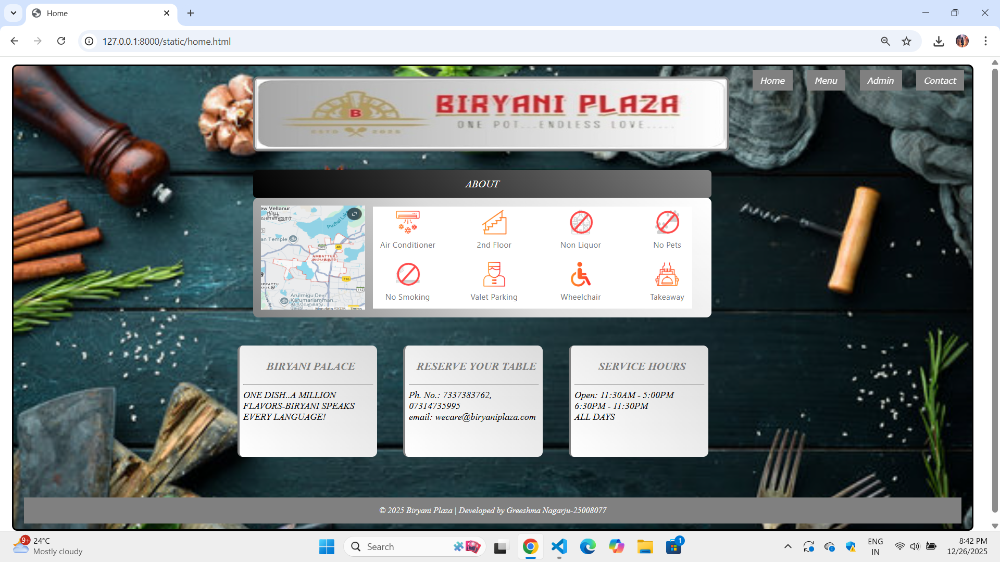
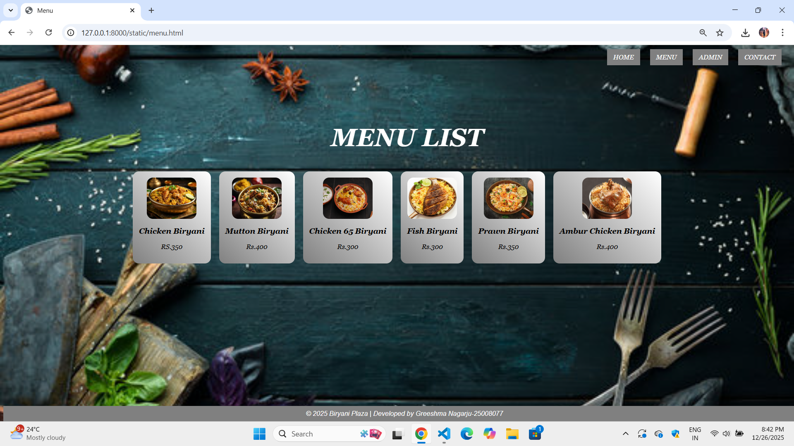
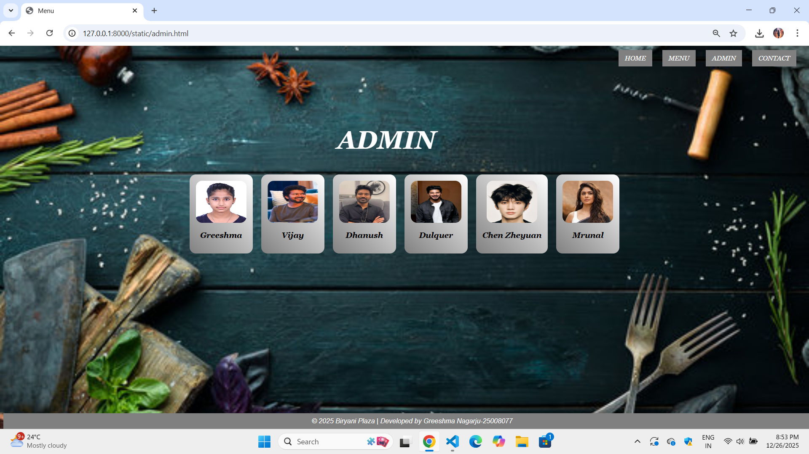

# Ex.06 Restaurant Website
## Date:26/12/2025

## AIM:
To develop a static Restaurant website to display the food items and services provided by them.

## DESIGN STEPS:

### Step 1:
Requirement collection.

### Step 2:
Creating the layout using HTML and CSS.

### Step 3:
Updating the sample content.

### Step 4:
Choose the appropriate style and color scheme.

### Step 5:
Validate the layout in various browsers.

### Step 6:
Validate the HTML code.

### Step 7:
Publish the website in the given URL.

## PROGRAM:
```
home.html

<html>
    <head>
        <title>Home</title>
        <link href="home.css" rel="stylesheet">
    </head>
    <body>
        <i>
            <div class="page">
        <div class="container">
            
        </div>
        <div class="header">
            <a href="home.html">Home</a>
            <a href="menu.html">Menu</a>
            <a href="admin.html">Admin</a>
            <a href="contact.html">Contact</a>
        </div>
        <br>
        <br>
        <div class="head">
            ABOUT
        </div>
        <div class="maps">
            <a href="https://www.google.com/maps/place/Ambattur,+Chennai,+Tamil+Nadu/@13.1188271,80.148606,14z/data=!3m1!4b1!4m6!3m5!1s0x3a5263ba9a487b3f:0x1e923f00f5206296!8m2!3d13.1185879!4d80.1574261!16zL20vMDZ0ZnZq?entry=ttu&g_ep=EgoyMDI1MTIwOS4wIKXMDSoKLDEwMDc5MjA2N0gBUAM%3D">
                
            </a>
            
            
        </div>
        <br>
        <br>
        <br>
        <div  class="boxes">
            <div class="box">
                <p>
                    <h3>BIRYANI PALACE</h3>
                     <hr>
                     ONE DISH..A MILLION FLAVORS-BIRYANI SPEAKS EVERY LANGUAGE!
                </p>
            </div>
            <div class="box">
                <p>
                    <h3>RESERVE YOUR TABLE</h3>
                     <hr>
                    Ph. No.: 7337383762, 07314735995<br>
                    email: wecare@biryaniplaza.com<br>
                </p>
            </div>
            <div class="box">
                <p>
                    <h3>SERVICE HOURS</h3>
                    <hr>
                    Open: 11:30AM - 5:00PM
                          6:30PM - 11:30PM <br>
                          ALL DAYS
                </p>
            </div>
        </div>
        
        <br>
        <br>
    
        
         <div class="footer">
            &copy 2025 Biryani Plaza | Developed by Greeshma Nagarju-25008077
            </i>
        </div>
            </div>
    </body>
</html>

menu.html
<html>
<head>
    <title>Menu</title>
    <link rel="stylesheet" href="menu.css">
</head>
<body>
    <i>
    
    <div class="nav">
        <a href="home.html">HOME</a>
        <a href="menu.html">MENU</a>
        <a href="admin.html">ADMIN</a>
        <a href="contact.html">CONTACT</a>
    </div>
    
    <h1 class="menu">MENU LIST</h1>
    <br>
    <br>
    <div class="container">
        <div class="list">
            
            <h3>Chicken Biryani</h3>
            <p>RS.350</p>
        </div>
        <div class="list">
            
            <h3>Mutton Biryani</h3>
            <p>Rs.400</p>
        </div>
        <div class="list">
            
            <h3>Chicken 65 Biryani</h3>
            <p>Rs.300</p>
        </div>
        <div class="list">
            
            <h3>Fish Biryani</h3>
            <p>Rs.300</p>
        </div>
        <div class="list">
            
            <h3>Prawn Biryani</h3>
            <p>Rs.350</p>
        </div>
        <div class="list">
            
            <h3>Ambur Chicken Biryani</h3>
            <p>Rs.400</p>
        </div>
    </div>
    <div class="footer">
         &copy 2025 Biryani Plaza | Developed by Greeshma Nagarju-25008077
    </div>
    </i>
</body>
</html>

admin.html

<html>
<head>
    <title>Menu</title>
    <link rel="stylesheet" href="menu.css">
</head>
<body>
    <i>
    <div class="nav">
        <a href="home.html">HOME</a>
        <a href="menu.html">MENU</a>
        <a href="admin.html">ADMIN</a>
        <a href="contact.html">CONTACT</a>
    </div>
    <h1 class="menu">ADMIN</h1>
    <br>
    <br>
    <div class="container">
        <div class="list">
            
            <h3>Greeshma</h3>
        </div>
        <div class="list">
            
            <h3>Vijay</h3>
        </div>
        <div class="list">
            
            <h3>Dhanush</h3>
        </div>
        <div class="list">
            
            <h3>Dulquer</h3>
        </div>
        <div class="list">
            
            <h3>Chen Zheyuan</h3>
        </div>
        <div class="list">
            
            <h3>Mrunal</h3>
        </div>
    </div>
    <div class="footer">
         &copy 2025 Biryani Plaza | Developed by Greeshma Nagarju-25008077
    </div>
    </i>
</body>
</html>


contact.html

<html>
    <head>
        <title>Home</title>
        <link href="home.css" rel="stylesheet">
    </head>
    <body>
        <i>
            <div class="page">
        <div class="container">
            
        </div>
        <div class="header">
            <a href="home.html">Home</a>
            <a href="menu.html">Menu</a>
            <a href="admin.html">Admin</a>
            <a href="contact.html">Contact</a>
        </div>
        <br>
        <br>
        <br>
        <br>
        <br>
        <br>
        <br>
        <br>
        <br>
        
        <div  class="boxes">
            <div class="box">
                <p>
                    <h3>VISIT US:<hr>Ambattur-Chennai<br>Tamil Nadu -602024</h3>
                     
                </p>
            </div>
            <div class="box">
                <p>
                    <h3>PHONE NO:<hr>7337383000</h3>
                     
                    
                </p>
            </div>
            <div class="box">
                <p>
                    <h3>EMAIL:<hr>biryaniplaza@gmail.com</h3>
                    
                </p>
            </div>
        </div>
            <br>
        <br>
        <br>
        <br>
        <br>
        <br>
        <br>
        <br>
        <br>
        <br>
        <br>
        <br>
        <br>
        
         <div class="footer">
            &copy 2025 Biryani Plaza | Developed by Greeshma Nagarju-25008077
            </i>
        </div>
            </div>
    </body>
</html>

home.css
.page
{
    background-image: url('back.jpg');
    background-repeat:no-repeat ;
    background-size: cover;
    height:850px;
     width:1800px;
     margin: 15px;
     padding:20px;
     border-radius: 10px;
     border:3px solid;
}

h3
{
    color: gray;
    text-align: center;
    margin-left: 10px;
}
.box
{
    width: 250;
    height:200;
    background: linear-gradient(45deg,white,gainsboro);
    font-size: 18px;
    border-left: 4px solid grey;
    border-radius: 10px;
    padding: 7px;
    margin-left: 10px;
    align-items: center;
}
.container
{
    
    width: 900;
    margin-left: 440px;
    background:gainsboro;   
    border:4px solid grey;         
    padding: 3px;
    border-radius: 10px;          
    display: flex; 
    flex-direction: row;               
    align-items: center;          
    gap: 15px;                   
     
}
.maps
{
    
    width: 850;
    margin-left: 440px;
    background:linear-gradient(45deg,gray,gainsboro,white);            
    padding: 15px;
    border-radius: 10px;          
    display: flex; 
    flex-direction: row;               
    align-items: center;          
    gap: 15px;                   
     
}
.head
{
    
    width: 850;
    margin-left: 440px;
    background:linear-gradient(45deg,black,gray);           
    padding: 15px;
    border-radius: 7px;          
    display: flex; 
    flex-direction: row;               
    align-items: center;          
    color: white; 
    font-size: 20px;
    justify-content: center;
                     
     
}
.boxes
 {
  display: flex;
  gap: 40px; 
  margin-left: 400px;
 }
.footer
{
    
    background-color: grey;
    margin-top: 42px;
    display: flex;
    justify-content: center; 
    align-items: center;     
    height: 50px; 
    color: white;
}


div p
{
    color:gray;
    margin-left: 0;
    text-align: center;
}
.header
{
    position: fixed;
    top: 30px;
    right: 50px;
    font-family: Verdana, sans-serif; 
    font-size: 22px;
    color:white;
}
a:hover
{
    background-color:PIN;
    color:white;
}
.header a 
{
    text-decoration: none;
    margin-left: 20px;
    padding: 10px 15px;
    background-color: gray;
    color:white;
    font-size: 16px;
}

menu.css

body{
    background-image: url("back.jpg");
    background-size: cover;
    background-position: center;
    font-family: Georgia, serif;
}


.nav{
    position: absolute;
    top: 20px;
    right: 30px;
}

.nav a{
    text-decoration: none;
    margin-left: 20px;
    padding: 10px 15px;
    background-color:  gray;
    color: WHITE;
    font-size: 16px;
}


.menu{
    position: absolute;
    top: 150px;
    text-align: center;
    left: 800px;
    font-size: 60px;
    color: white;
}


.container{
    position: relative;
    top: 260px;
    display: flex;
    justify-content: center;
    gap: 20px;
}


.list{
    background:linear-gradient(45deg,grey,white);
    padding: 15px;
    text-align: center;
    border-radius: 15px;
}

.list img{
    width: 120px;
    height: 100px;
    border-radius: 15px;
}
.footer{
    position: fixed;
    bottom: 0;
    width: 100%;
    background-color: gray; 
    color:white; 
    text-align: center;
    font-family: Arial, sans-serif; 
    padding: 10px;
}

admin.css
body{
    background-image: url("back.jpg");
    background-size: cover;
    background-position: center;
    font-family: Georgia, serif;
}


.nav{
    position: absolute;
    top: 20px;
    right: 30px;
}

.nav a{
    text-decoration: none;
    margin-left: 20px;
    padding: 10px 15px;
    background-color:  gray;
    color: WHITE;
    font-size: 16px;
}


.menu{
    position: absolute;
    top: 150px;
    text-align: center;
    left: 800px;
    font-size: 60px;
    color: white;
}


.container{
    position: relative;
    top: 260px;
    display: flex;
    justify-content: center;
    gap: 20px;
}


.list{
    background:linear-gradient(45deg,grey,white);
    padding: 15px;
    text-align: center;
    border-radius: 15px;
}

.list img{
    width: 120px;
    height: 100px;
    border-radius: 15px;
}
.footer{
    position: fixed;
    bottom: 0;
    width: 100%;
    background-color: gray; 
    color:white; 
    text-align: center;
    font-family: Arial, sans-serif; 
    padding: 10px;
}

contact.css
.page
{
    background-image: url('back.jpg');
    background-repeat:no-repeat ;
    background-size: cover;
    height:850px;
     width:1800px;
     margin: 15px;
     padding:20px;
     border-radius: 10px;
     border:3px solid;
     color:white;
}
.box
{
    margin-left: 800px;
    display: flex;
    background:linear-gradient(45deg,grey,white);
    height: 800px;
    justify-content:center;
}


.container
{
    
    width: 900;
    margin-left: 440px;
    background:gainsboro;   
    border:4px solid grey;         
    padding: 3px;
    display: flex;
    flex-direction: column;
    border-radius: 10px;                   
    gap: 15px;                   
     
}


.footer
{
    
    background-color: grey;
    margin-top: 42px;
    display: flex;
    justify-content: center; 
    align-items: center;     
    height: 50px; 
    color: white;
}


.header
{
    position: fixed;
    top: 30px;
    right: 50px;
    font-family: Verdana, sans-serif; 
    font-size: 22px;
    color:white;
}
a:hover
{
    background-color:PIN;
    color:white;
}
.header a 
{
    text-decoration: none;
    margin-left: 20px;
    padding: 10px 15px;
    background-color: gray;
    color:white;
    font-size: 16px;
}

```

## OUTPUT:




## RESULT:
The program for designing software company website using HTML and CSS is completed successfully.
